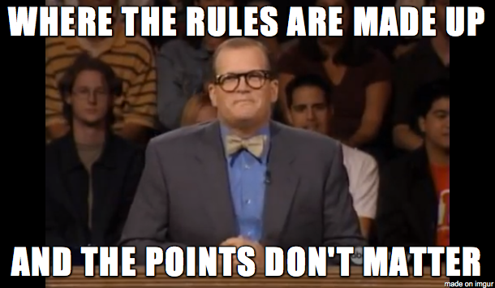

# Working with me

A way for you to understand why I am here and for us to measure success. This is heavily inspired by [Rands](http://randsinrepose.com/archives/how-to-rands/) and others.

## Contents

- [My role](#my-role)
- [My assumptions about you](#my-assumptions-about-you)
- [Our team](#our-team)
- [How we work with AI](#how-we-work-with-ai)
- [Communication](#communication)
- [One-on-ones](#one-on-ones)
- [Feedback](#feedback)
- [Metrics](#metrics)
- [Meetings](#meetings)

## My role

Whether I'm your manager or your team lead, the job is the same at its core: help the team deliver awesome software.

That means I:

- Find, retain, and encourage really smart developers (that's you).
- Provide context.
- Destroy obstacles.
- Build prototypes, design systems, and review code.
- Am the face of the team to stakeholders.
- Do enough individual-contributor work to stay effective at all of the above and connected to the solutions.

## My assumptions about you

- You are good at your job.
    - If you weren't, you wouldn't be here.
    - I will still question you. When I do, it is because:
        - I'm trying to learn more about what you know and I don't.
        - I'm trying to be a sounding board and make sure you do your best work.
- You have more detailed knowledge than I do of what you are doing.
    - I have more context than you do. (Context is part of what I do here.)
- You will tell me if you are having trouble doing your job.
    - One of my main responsibilities is setting you up for success, not failure.
    - You will know before I do if you are not set up for success, so say something.
- You feel safe debating with me.
    - The best ideas are those that have been viewed from multiple angles and been the subject of debate and discussion.
        - Sometimes I will play devil's advocate for this purpose alone.
        - Sometimes I'm just being dense.

## Our team

### Core needs

[Adapted from Google's ideas on what teams need](https://rework.withgoogle.com/blog/five-keys-to-a-successful-google-team/):

- **Psychological safety** — Can we take risks on this team without feeling insecure or embarrassed?
- **Dependability** — Can we count on each other to do high quality work on time?
- **Structure & clarity** — Are goals, roles, and execution plans on our team clear?
- **Meaning of work** — Are we working on something that is personally important for each of us?
- **Impact of work** — Do we fundamentally believe that the work we're doing matters?

### Vision

- We are all contributing at a high level.
    - We deliver features that bring joy to our customers or at least remove sources of pain and frustration.
    - To our stakeholders, we are big damn heroes.
- We take control of, and responsibility for, our own destiny.
    - We identify challenges and opportunities and come up with solutions.
    - If something is beyond our control, we look for ways to get it under our control or get help.
- We help each other.
- We hold each other accountable.
- We can expect excellence in ourselves and each other.
- We assume positive intent.
- We always ask "why?" and especially "Why can't we just make it be better?"
- We constantly learn and adapt.
    - If something isn't working, we change it.
- All of this is both fun and sustainable.

### Attendance

- We work a reasonable number of hours.
    - We occasionally work overtime during crunch periods.
    - But we understand that extended overtime...
        - Makes us unhappy.
        - Actually reduces productivity.
- We respect our team members by being available, being on time, and giving people time to adjust.
    - We try to give warning when we won't be in.
    - Life happens: people get sick, child care falls through, furnaces give out, so we are flexible.
        - But we need to give our team members warning.
        - If we will take a day, we give notice as soon as we know. We announce it and put it on the vacation calendar.
    - When one person is remote for a team meeting, everybody is remote for that meeting.
- When we do get sick...
    - We take care of ourselves by resting when we cannot or should not work.
    - We take care of our team by working from home when we are contagious.
- Nobody [goes dark](https://blog.codinghorror.com/dont-go-dark/) for an extended period.

### Practices

**Code**

- We work in the open.
    - Everybody ships something every day. Delivery is a muscle — the reps are now as much about directing and judging work as typing it. We exercise it either way.
    - Most people have a PR most days.
- Everybody reviews code.
    - Your input is valuable.
    - Do not hesitate to review code written by more experienced people.
    - Whoever — or whatever — wrote it, we review it and we own it.

**Testing**

- We own the quality of our code.
    - We test our own work *before* anyone else can find our mistakes.
    - We think about testability as a first-class concern.
    - We test 100% of the code we think needs testing.
    - We test 0% of the code we don't think needs testing.
    - We can depend on our tests.

**Standup**

- We talk about what we have been doing since our last stand.
- We talk about what we plan to do before our next stand.
- We talk about blocking issues.
- We talk about discovered tasks or complications.
- We review our collective situation.
    - Do we have open PRs that need review?
    - Are we likely to exceed or miss sprint commitments?
        - Do we need to communicate to our stakeholders?
        - Do we need to find additional work?
- We talk about any issues of common interest.
    - e.g. "Remember, I'm off all next week so if you need me, get me before 3."

## How we work with AI

- We use AI aggressively. It is the biggest lever we have, and refusing to use it well is a competitive disadvantage.
- The model writes a lot of the code. That does not change who owns it. We do.
- Our job is shifting from producing code to directing, reviewing, and judging it.
    - Taste and judgment are the scarce resources now, not typing speed.
    - "The model wrote it" is never an excuse for shipping something we don't understand.
- **Judgment is a human responsibility, and it does not get delegated to the model.** A person is always accountable for what we ship.
    - I am against "dark factory" software — fully autonomous pipelines that ship with no human in the loop. Not because the machines can't produce code, but because responsibility can't be automated.
    - The machine can do the work. A person still has to own the call. Keeping a human on the hook for judgment is a feature, not friction.
- Context is the input. The better we frame the problem, the better the output — for humans and models alike. (See also: providing context is a big part of what I do here.)
- We stay honest about where AI helps and where it hurts. When it starts driving the wrong behavior, we stop and talk about it, same as with any tool or metric.

## Communication

- Face to face is best.
- Emails — I will reply in < 24 hours.
- Slack — you should expect to get an answer right away. I will do my best.
- If it ever feels like we are not communicating, grab me and let's hash it out.
- I feel very strongly that teams need to over-communicate their progress.
    - Transparency builds trust.
    - We should be open and transparent about our successes and our failures.
    - Typically, this takes the form of a weekly status email going to all stakeholders.

## One-on-ones

- These are primarily your time to talk about whatever you want.
- Secondarily, they are for me to talk about what I want to talk about, but you come first.
- They shouldn't be status updates unless you really want to talk about status updates.
- These are flexible depending on our schedule, but we need to have them.

## Feedback

- Honest, compassionate feedback is one of the most important tools we have.
- This needs to go both ways.
    - I'm going to make mistakes.
        - I expect you to tell me when that happens.
        - Yeah, it might be hard, but I'm counting on you.

## Metrics

I like to count things.

- Story points help us understand our capacity and our velocity.
- Bug counts tell us if we have a quality problem.
- Production support tickets tell us where we need to improve the system.
- Performance metrics ensure our products work the way we need them to.
- Monitoring ensures we aren't the last to learn about a problem.

I don't want to be ruled by metrics, but they let us stay on top of the chaos. If our metrics ever seem to be driving the wrong behavior, we need to stop and talk about it. See [Feedback](#feedback).

A caveat that matters more every day: when a model can open ten PRs before lunch, output volume gets cheap. Counting code produced increasingly measures the tool, not the person. So I weight the output metrics below lightly, and I care most about **judgment** — did we ship the right thing, did we catch the subtly-wrong thing, and what escaped to production.

### Output metrics

**Story points**

I don't quite agree with that. Sure, the dishonest can game it, but why would we work with dishonest people? Story points are useful for estimating and planning, and have some utility for measuring outcomes. As an output metric, they are of some use in knowing if the team is producing.

**PR throughput**

PR throughput measures how many changes we each get to production. Small, safe changes we iterate on are what we want. But this is the metric AI distorts most: raw PR count is now trivial to inflate, so I read it alongside what those PRs *did*, not as a scoreboard.

**Escaped defects**

The metric I trust most in a world of cheap code: what broke in production that we should have caught. It measures the thing that actually still depends on us — judgment and review — rather than how fast code got typed.

**PR cycle time**

Stale PRs are hard to get merged because too much changes. PR cycle time tells us if our PRs are too complicated or if we aren't putting enough emphasis on reading code.

### Input metrics

**Delivery days per week**

I am a strong believer that every developer should engage with the codebase and ship something every day — whether that is code they wrote, code they directed a model to write, or a review that made someone else's work better. The point is staying in the flow of delivery, not the keystrokes. Averaging > 4.0 delivery days per week seems like the right number to me:

`52 * 5 - 10 days of holidays and 20 days PTO = 4.42 days per week.`

## Meetings

- We can always do an informal "help me talk through an idea" without a formal agenda. (Although, in reality the agenda is "Let's talk through connection pooling" or whatever.)
- Any meeting over 15 minutes needs to have an agenda.
    - If I call a meeting > 15 minutes with no agenda, call me out.
    - If possible, we should have a common set of notes for meetings so we know who agreed to what.
    - Meetings produce artifacts: notes or even screenshots of whiteboards.
- Story grooming is important to get everybody on the same page.
- Retrospectives are important to help us improve.
